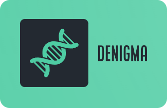

  

  
  
  
  

`DeNigmA` is made up of the two words `Enigma` (message encryption) and `DNA` (deoxyribonucleic acid) and is a hobby project for the visualisation of DNA and RNA sequences. The basic idea is adapted from [seqviz](https://github.com/Lattice-Automation/seqviz) and is to be structured similarly, but further modified and enhanced.

## Running & Debugging the application

1. Clone repo:
   - `git clone https://github.com/xKabbe/denigma.git`
2. Install project dependencies:
   - `cd denigma`
   - `npm run init` (performs a [Clean Install](https://docs.npmjs.com/cli/v8/commands/npm-ci))
3. Restart VS Code to refresh TypeScript Intellisense, otherwise you might see errors in the editor:
   - Close VS Code
   - Open a new VS Code window
   - Open the folder where the project was cloned
4. Start the application:
   - Open a new terminal
   - `npm start`
5. Start debugging in VS Code:
   - Press `F5` or click on `Run and Debug` > `Green Debug Icon`
   - You can set breakpoints and inspect components in the [React Developer Tools](https://chrome.google.com/webstore/detail/react-developer-tools/fmkadmapgofadopljbjfkapdkoienihi)

More commands regarding testing, debugging and running the application are:

| Command               | Description                                      | Evironment File |
| :-------------------- | :----------------------------------------------- | :-------------- |
| `npm test`            | Executes Unit Tests outputting to `out/coverage` | .env.test       |
| `npm start`           | Runs the App in http://localhost:3000            | .env.local      |
| `npm run start-https` | Runs the App in https://localhost:3001 (HTTPS)   | .env.local      |
| `npm run sbook`       | Runs Storybook in http://localhost:3002          | .env.local      |
| `npm run sbook-https` | Runs Storybook in https://localhost:3003 (HTTPS) | .env.local      |

## Creator

[Steven Karbjinsky](https://github.com/xKabbe)

## Copyright and License

Code and documentation released under [the MIT license](https://github.com/xKabbe/denigma/blob/master/LICENSE)
